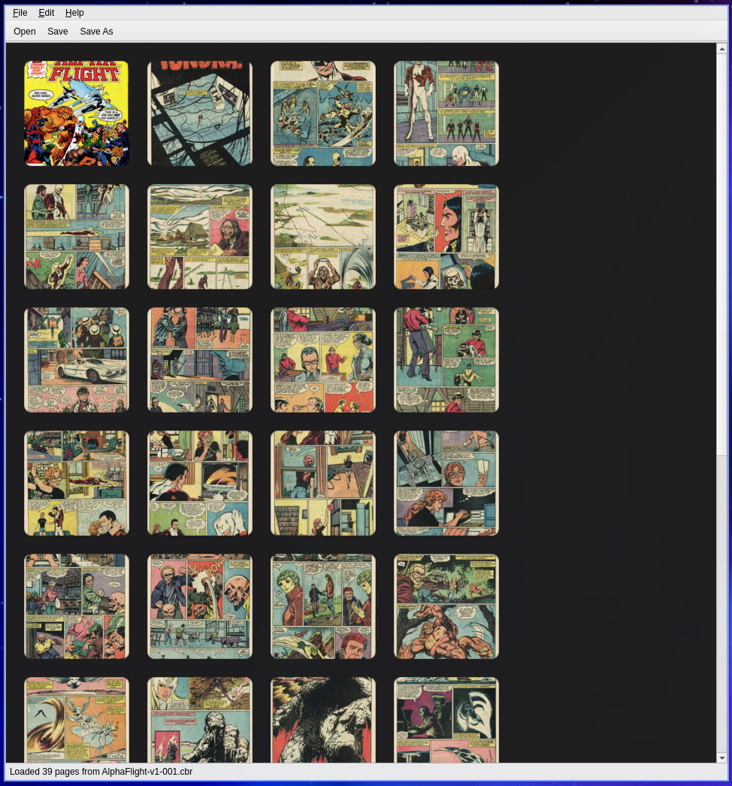
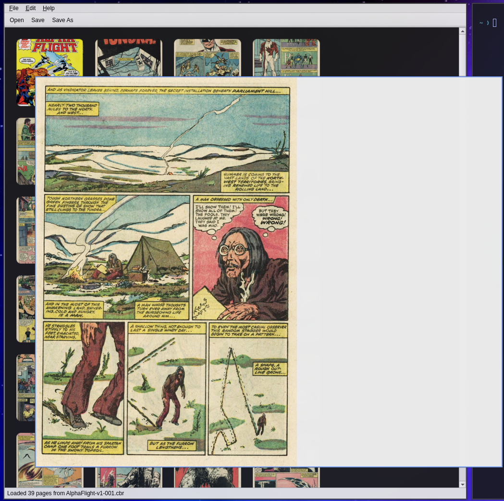

# CBRRanger 


A simple, focused desktop tool for rearranging pages in digital comic book files
(CBR/CBZ). Open a comic, see every page as a thumbnail in a grid, drag and drop
pages to reorder them, and save the result.



## Features

- Opens **CBZ** (ZIP) and **CBR** (RAR) comic archives
- Thumbnail grid with drag-and-drop page reordering
- One-click zoom to show full image
- Multi-select with **Move to Front** / **Move to Back**
- Undo/redo for every reorder
- Natural page sorting (`page10` comes after `page9`, not after `page1`)
- Preserves `ComicInfo.xml` metadata unchanged
- Safe saves: writes to a temp file first, so the original is never corrupted
- Always saves as CBZ (lossless, universally supported — writing CBR requires
  the proprietary `rar` binary)




## Requirements

- Python 3.11+
- For **CBR** support, a RAR extraction tool must be installed:

  | Platform | Command |
  |---|---|
  | Arch | `sudo pacman -S unrar` |
  | Debian/Ubuntu | `sudo apt install unrar` |
  | Fedora | `sudo dnf install unrar` |
  | FreeBSD | `pkg install unrar` |
  | macOS | `brew install unar` |

  CBZ files work with no extra dependencies.

- On Linux, Qt6 needs the usual X11/Wayland client libraries (`libxcb` and
  friends). Desktop installs normally have these already.

## Install

1. Create and activate a virtual environment:

   ```sh
   python3 -m venv env
   source env/bin/activate
   ```

2. Install dependencies:

   ```sh
   pip install -r requirements.txt
   ```

3. Run the application:

   ```sh
   python3 main.py
   ```

   You can also pass a file to open directly: `python3 main.py my_comic.cbz`

## Usage

1. **File → Open** (Ctrl+O) and pick a `.cbz` or `.cbr` file.
2. Drag thumbnails to reorder pages. Select multiple pages and use
   **Edit → Move to Front/Back** for bulk moves. Ctrl+Z / Ctrl+Y to undo/redo.
3. **File → Save** (Ctrl+S). CBR input is saved as CBZ via Save As — a
   lossless format change. Pages are renamed sequentially (`0001.jpg`,
   `0002.jpg`, …) so the order holds in any reader.

Unsaved changes are marked with `*` in the title bar, and you are prompted
before closing or opening another file.

## Development

```sh
pip install -r requirements-dev.txt
pytest                  # run the test suite (works headless via offscreen Qt)
black src tests         # format
ruff check src tests    # lint
```

Test fixtures are generated programmatically with Pillow — no real comic
files are committed.

## Out of scope

This is a *reorder* tool, not a reader. Full-size page viewing, metadata
editing, splitting/merging archives, format conversion, and PDF support are
intentionally not included.
